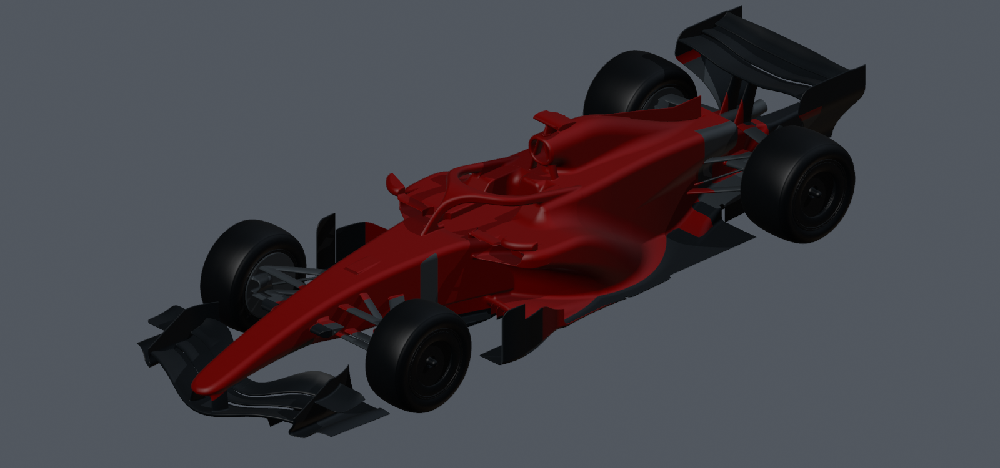
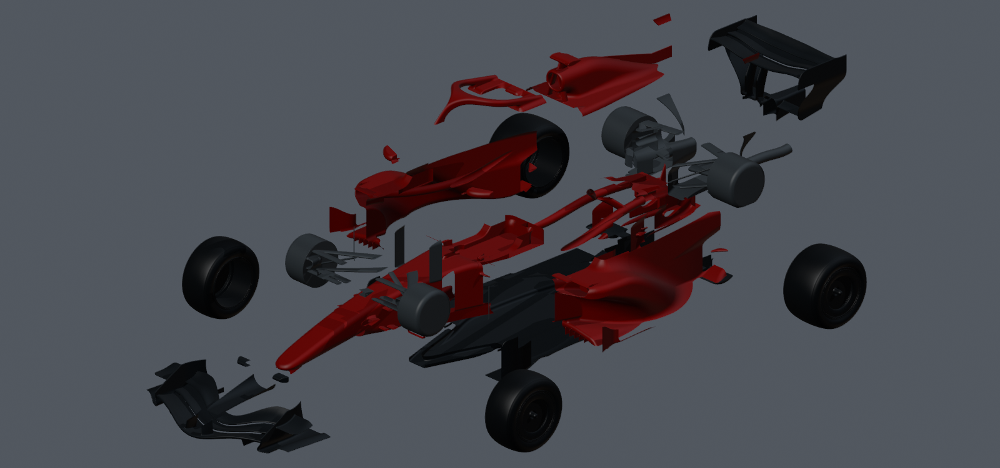
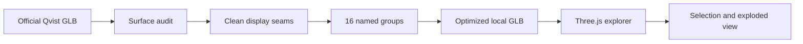

<div align="center">

# APEX — F1 2026 Exploded View

### Explore a Formula One concept car, piece by piece.

[](https://threejs.org/)
[](https://creativecommons.org/licenses/by/4.0/)
[](#the-16-groups)
[](#verification)



**APEX** is an interactive WebGL experience that lets you orbit, inspect and pull apart Qvist_designs’ 2026 Formula One concept directly in the browser.

</div>

> [!IMPORTANT]
> This is Qvist_designs’ independent 2026 concept, not Ferrari SF-26 CAD. The bodywork was originally fused, so its clean separation seams are illustrative display cuts rather than verified manufacturing joints. The source does not include a complete internal power unit.

## The experience



Move the disassembly slider from a complete car to a full exploded view. Select any visible part—or choose it from the component list—to highlight it and read about its role. The camera includes perspective, side and top views, plus orbit, zoom, auto-rotation and an optional ground grid.

| Explore | Understand | Reassemble |
| --- | --- | --- |
| Click modeled geometry or use the component list. | Read focused descriptions for each aerodynamic, structural and running-gear group. | Return every group to its exact original transform without accumulated drift. |

## The 16 groups

| Area | Groups |
| --- | --- |
| Aerodynamics | Front wing · Floor & diffuser · Rear wing |
| Structure | Nose & chassis |
| Bodywork | Left sidepod · Right sidepod · Airbox & engine cover |
| Running gear | Front suspension · Rear suspension |
| Wheels | Front left · Front right · Rear left · Rear right |
| Cockpit | Halo · Mirrors |
| Powertrain exterior | Exhaust outlet |

## Controls

| Action | Control |
| --- | --- |
| Rotate the car | Drag |
| Zoom | Scroll or pinch |
| Inspect a group | Click the model or its name |
| Disassemble | Move the slider or press **Explode view** |
| Change viewpoint | Choose **3D view**, **Side**, or **Top** |
| Reset the camera | Press the reset icon |

## Run locally

You need a current version of [Node.js](https://nodejs.org/).

```bash
git clone https://github.com/filan214/f1-2026-exploded-view.git
cd f1-2026-exploded-view
npm install
npm run dev
```

Open [http://localhost:5173](http://localhost:5173), then use `npm run check` whenever you change the model pipeline or interaction code.

## How it works



The original Sketchfab download contains 11 anonymous export chunks rather than mechanical parts. The preparation script joins those chunks for inspection, retains the original surface, adds clean cuts where fused bodywork must separate, and exports a self-contained 16-node GLB. Constant vertex colours are removed and lightweight red and graphite materials provide the presentation finish.

The site loads all assets locally—there is no third-party model CDN at runtime. Each mesh must belong to exactly one group before the explorer accepts it. Explosion positions are calculated from a fixed home transform, keeping every repeated disassembly reversible.

## Project map

```text
dist/
├── index.html                interface and accessible structure
├── app.js                    scene, camera, selection and controls
├── imported-car.js           mapping, transforms and highlighting
├── load-car.js               GLB/glTF/FBX loader and fallback
├── models/                   source, prepared model and attribution
└── vendor/                   pinned Three.js runtime and loaders
scripts/
├── build-qvist.mjs           repeatable model preparation
├── prepare-qvist.py          Blender shell audit
└── render-qvist.py           offline reference renders
tests/                        geometry and interaction checks
```

## Verification

The automated suite checks:

- all 16 configured groups load and own their geometry;
- the prepared model retains the original surface area and silhouette;
- every group can be selected with the same raycasting used by the interface;
- repeated explode and reassemble cycles restore exact transforms;
- source credit and CC BY 4.0 metadata remain present;
- the static entry point and local module references are valid.

Run the full suite:

```bash
npm run check
```

## Model attribution

**F1 2026 concept (polygon model)** by [Qvist_designs](https://sketchfab.com/Qvist_Designs), downloaded from [Sketchfab](https://sketchfab.com/3d-models/f1-2026-concept-polygon-model-ea3bde709b1e4dc9b0ec8557d106ed42) and used under [CC BY 4.0](https://creativecommons.org/licenses/by/4.0/).

Changes made for APEX: regrouped export chunks into 16 selectable display assemblies; subdivided crossing triangles to create clean separation seams in fused bodywork; retained the original surface and silhouette; baked coordinate orientation; assigned red and graphite study finishes; removed redundant uniform vertex colours; and normalized display size at runtime. See the complete [model attribution and changes notice](dist/models/ATTRIBUTION.md).

The web application uses [Three.js](https://threejs.org/) under the MIT License. No endorsement by Qvist_designs, Ferrari, Formula One or the FIA is implied.

---

<div align="center">

**Built to be understood.**

</div>
